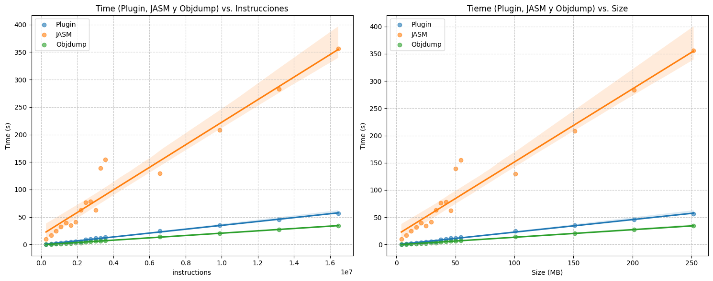
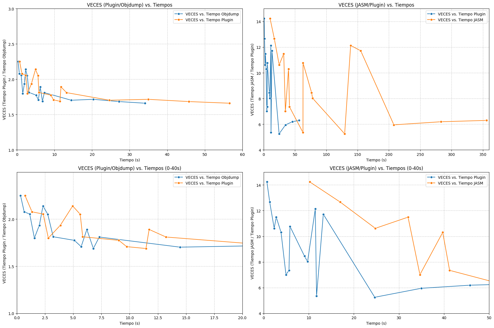
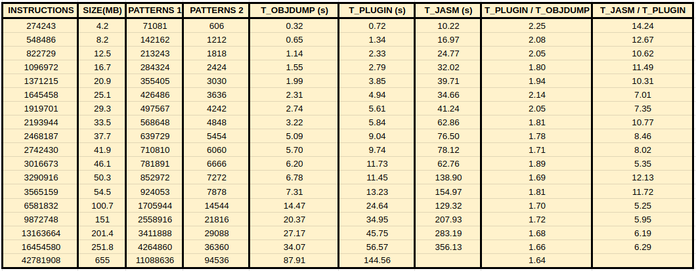

[[_TOC_]]

## 🎯 Purpose and Functionality
**Project**: Dynamic Plugin System for GNU objdump
**Main Objective**: To extend objdump (GNU Binutils' disassembly tool) with a callback/hook system that allows for real-time instruction analysis during disassembly, without substantially modifying the code.

**Building:**
```
git clone git://sourceware.org/git/binutils-gdb.git
```
Then:
```cd ~/Desktop/plugindecero/binutils-gdb
rm -rf build
mkdir build
cd build
../configure \
--disable-gdb \
--disable-gdbserver \
--disable-gas \
--disable-ld \
--disable-nls
make all-binutils
```
**Implemented Functionality**:
- System of dynamic plugins (.so) loaded at runtime via dlopen/dlsym
- 5 types of hooks/callbacks:

1. **Valid Statement**: Analyzes each disassembled statement
2. **Invalid Statement**: Catches disassembly errors
3. **File**: Notifies when a new file is processed
4. **Section**: Notifies you of section changes (.text, .data, etc.)
5. **Label/Symbol**: Notifies you when a symbol is found
---
## 🛠️ Approach and Methodology

### **Project Restrictions**
- **Minimize changes to opcodes**: Only add hook calls, without altering disassembly logic
- **Modular Architecture**: Plugin as an independent shared library
- **Compatibility**: Do not break existing objdump functionality

### **Development Phases**

1. **Interface Design** (xxxx_dis_info.h, objdump_plugin.h)

- Define the instr_info struct with the necessary fields depending on the architecture
- Define callbacks for the plugin

2. **Disassembler Integration**

- Capture mnemonics and operands BEFORE printf
- Insert hook calls at key moments
- Handle invalid instructions

3. **Dynamic Loading** (objdump.c)

- Plugin loading system with dlopen
- Bridging functions between disassembler and plugin
- Integration of hooks into the objdump stream

4. **Plugin Implementation** (objdump_plugin.c)

- Parsing of AT&T operands
- Sorting by type (Reg/Mem/Imm/Addr)
- Instruction counter and statistics
---

## 📊 Results Obtained

### **Example Output**
```
[Instruction #287] or [OPERAND x2] %al (%rax)
[BAD] bad instruction encountered
[Instruction #288] add [OPERAND x4] %bl (%rax %rax 1)
[Instruction #289] add [OPERAND x2] %al (%rax)
[Instruction #290] cmp [OPERAND x2] $0x0 %al
[Instruction #291] add [OPERAND x2] %al (%rax)
[Instruction #292] add [OPERAND x2] %al (%rax)
[Instruction #293] add [OPERAND x2] %al (%rax)
[Instruction #294] or [OPERAND x2] (%rax) %eax
[Instruction #295] add [OPERAND x2] %al (%rax)
[Instruction #296] add [OPERAND x2] %al 0xe(%rbp)
[Instruction #297] adc [OPERAND x2] %al 0x60d4302(%rsi)
[Instruction #298] or [OPERAND x2] $0x7 %al
[Instruction #299] or [OPERAND x2] %al (%rax)

[INFO] Instructions written to: disasm_output.txt

╔════════════════════════════════════════════════╗
[INFO] Plugin closed                             ║
║ INSTRUCTION STATISTICS                         ║
║ Architecture: elf64-x86-64                     ║
╠════════════════════════════════════════════════╣
║ Total files processed: 3                       ║
║ Total sections processed: 15                   ║
║ Total labels processed: 10                     ║
║ Total instructions: 299                        ║
║ Invalid instructions (BAD): 19                 ║
╠════════════════════════════════════════════════╣
║ Calls (CALL): 0                                ║
║ Jumps (JUMP): 16                               ║
║ Returns (RET): 6                               ║
║ Instructions with REX.W: 21                    ║
║ Atomic operations (LOCK): 0                    ║
║ String operations (REP): 6                     ║
║ Stack canaries detected: 0                     ║
╚════════════════════════════════════════════════╝
║ Regex pattern dereference (file): 201          ║
║ Regex pattern indirect call (file): 0          ║
╚════════════════════════════════════════════════╝
```
### **Files**
- **NEW** (3):

/plugin
- objdump_plugin.h
- objdump_plugin_arm
- objdump_plugin_mips.g
- objdump_plugin_x86_64.h
- objdump_plugin_i386.h
- objdump_plugin.cpp - Plugin with usage examples
- objdump_pluginv2.cpp - Basic plugin

/opcodes
- i386_dis_instr_info.h - Shared struct definition
- arm_dis_instr_info.h
- x86_64_dis_instr_info.h
- mips_dis_instr_info.h

**MODIFIED**

/opcodes
- i386-dis.c
- arm-dis.c
- mips-dis.c

/binutils

- objdump.c - Dynamic loading system
---
## **OBJUMP.C. ARCHITECTURE SUMMARY**
```
      main() start
            ↓
      ┌─────────────────────┐
      │ init_plugin()       │ ← ADDED
      │ dlopen(.so)         │
      │ dlsym(callbacks)    │
      └─────────────────────┘
            ↓
      Process files...
            ↓
      ┌─────────────────────┐
      │ file_hook()         │ ← ADDED
      └─────────────────────┘
            ↓
      ┌─────────────────────┐
      │ section_hook()      │ ← ADDED
      └─────────────────────┘
            ↓
      ┌────────────────────┐
      │ label_hook()       │ ← ADDED
      └────────────────────┘
            ↓
      Disassemble...
            ↓
      architecture-dis.c call → hook_instruction() ← ADDED
            ↓
      g_plugin_callback(ins)
            ↓
      objdump_plugin.so
            ↓
      main() final
            ↓
      ┌─────────────────────┐
      │ cleanup_plugin() │ ← ADDED
      │ print_stats() │
      │ dlclose(.so) │
      └─────────────────────┘
```
---


## **SUMMARY OF THE ARCHITECTURE architectureX-dis.c**

```
    ┌───────────────────────────────────┐
    │ i386-dis.c (opcodes)              │
    │ ┌───────────────────────────────┐ │
    │ │ print_insn()                  │ │
    │ │ 1. Decode instruction         │ │
    │ │ 2. Fill obuf with mnemonic    │ │
    │ │ 3. ★ SAVE to ins.mnemonic     │◄──────┼─── CHANGE 3: Capture BEFORE Print
    │ │ 4. Print mnemonic             │ │
    │ │ 5. Build op_txt[]             │ │
    │ │ 6. ★ SAVE to ins.operands     │◄──────┼─── CHANGE 4: Capture BEFORE losing scope
    │ │ 7. Print operands             │ │
    │ │ 8. ★ hook_instruction(&ins)   │───────┼─── CHANGE 5: Notify plugin
    │ │ 9. return                     │ │
    │ └────────────────────────────── ┘ │
    └───────────────────────────────────┘
                ↓ (pass full struct)
    ┌──────────────────────────────────┐
    │ objdump.c (binutils)             │
    │ ┌──────────────────────────────┐ │
    │ │ instruction_hook(ins)        │ │
    │ │ → g_plugin_callback(ins)     │─┼─── Calls the .so plugin
    │ └──────────────────────────────┘ │
    └──────────────────────────────────┘
                ↓
    ┌──────────────────────────┐
    │ objdump_plugin.so        │
    │ ┌──────────────────────┐ │
    │ │ plugin_callback(ins) │ │
    │ │ → Read ins->mnemonic │ │
    │ │ → Read ins->operands │ │
    │ │ → Analyze and display│ │
    │ └──────────────────────┘ │
    └──────────────────────────┘
```
**arquitecturaX_dis_info.h is NEW** - it was created specifically for the plugin system.

**Originally** in binutils-gdb:
- `struct instr_info` was defined INSIDE arquitecturaX-dis.c (it was private)
- There was no shared header for this structure
- Only opcodes could use this structure

**The problem**:
- The plugin (in binutils) needs to access `struct instr_info`
- But the definition was enclosed in arquitecturaX-dis.c
- You cannot include a .c file from another module

**The solution**:
1. **Extract** the definition of `struct instr_info` from arquitecturaX-dis.c
2. **Create** a new header specifically for a particular arquitectura_dis_info.h file with the necessary fields for each architecture. Move the definition of `struc_instr_info` from `.c` to `.h`

3. **Share** between `opcodes/` and `binutils/`

---

## **SUMMARY OF CHANGES FOR `i386_dis_info.h`

| Item | Status | Explanation |

|----------|--------|-------------|

**Full File** | NEW | Did not exist, created to share definitions |

`MAX_OPERANDS` | Moved | Was in `i386-dis.c`, extracted here |

`MAX_OPERAND_BUFFER_SIZE` | Moved | Was in `i386-dis.c`, extracted here |

`MAX_CODE_LENGTH` | Moved | Was in `i386-dis.c`, extracted here |

`enum address_mode` | Moved | It was in i386-dis.c, it was extracted here |

`enum x86_64_isa` | Moved | It was in i386-dis.c, it was extracted here |

`enum evex_type` | Moved | It was in i386-dis.c, it was extracted here |

`struct instr_info` (fields 1-50) | Moved | It was in i386-dis.c, it was extracted here |

`char mnemonic[64]` | **NEW** | Added to the struct to store the mnemonic |

`char operands[256]` | **NEW** | Added to the struct to store operands |

---
## **WHY WAS IT NECESSARY TO CREATE THIS FILE?**

**Architectural Problem**:
```
opcodes/ ──┐
           ├─── Cannot share code directly
binutils/──┘ (separate modules)
```

**Solution with shared header**:
```
              i386_dis_info.h

                      ↑
        ┌─────────────┼─────────────┐

        ↓                           ↓
opcodes/i386-dis.c          binutils/objdump.c

(data producer)             (data consumer)
```

---

# **objdump_plugin.h and objdump_plugin.c**
---

These **two files are COMPLETELY NEW** - they did not exist in the original binutils-gdb. They were created specifically to implement the plugin system.

---

## **FILE 1: objdump_plugin.h (Plugin Header)**

This file **DEFINES THE INTERFACE** between objdump and the plugin.

```c
#ifndef OBJDUMP_PLUGIN_H
#define OBJDUMP_PLUGIN_H
// Generic callback typedefs 
typedef void (*plugin_cb_t)(void *); 
typedef void (*bad_plugin_cb_t)(const char *);
typedef void (*file_plugin_cb_t)(const char *);
typedef void (*section_plugin_cb_t)(const char *, const char *);
typedef void (*label_plugin_cb_t)(const char *, const char *, unsigned long);
#endif // OBJDUMP_PLUGIN_H
```
objdump.c necesita saber:
1. Qué funciones buscar en el plugin .so
2. Qué tipo de parámetros aceptan esas funciones

**Solución**: Definir **tipos de función** (function pointers) para cada callback

---
## **COMPLETE COMMUNICATION FLOW**

```
      ┌──────────────────────────────────────────────────┐
      │ i386-dis.c (opcodes)                             │
      │ - Decodes instruction                            │
      │ - Fills mnemonic instruction = "push"            │
      │ - Fills ins.operands = "%rbp"                    │
      │ - Call: hook_instruction(&ins)                   │
      └────────────────┬─────────────────────────────────┘
                       │ 
                       ↓
      ┌─────────────────────────────────────────────────┐
      │ objdump.c (binutils)                            │
      │ void instruction_hook(struct instr_info *ins) { │
      │ g_plugin_callback(ins); ← Call the .so          │
      │ }                                               │
      └───────────────┬─────────────────────────────────┘
                      │ 
                      ↓ 
      ┌────────────────────────────────────────────────┐
      │ objdump_plugin.so (compiled from .c)           │
      │                                                │
      │ void plugin_callback(struct instr_info *ins) { │
      │ insn_count++;                                  │
      │ printf("[Instruction #%lu] ", insn_count);     │
      │ printf("%-8s", ins->mnemonic); ← "push"        │
      │                                                │
      │ // Separate operands with a comma              │
      │ tokens = split(ins->operands, ",");            │
      │                                                │
      │ // Analyze each operand                        │
      │ explain_operand("%rbp");                       │
      │ ↓                                              │
      │ [Reg: %rbp] ← Print explanation                │
      │ }                                              │
      └────────────────────────────────────────────────┘
```
---
## 🏗️ Multi-Architecture Support and Test Execution

### Multi-Architecture Implementation

The plugin system is designed to support multiple architectures (ARM, MIPS, x86_64, i386) by using preprocessor macros (`-DTARGET_X86_64`, `-DTARGET_ARM`, etc.) when compiling the plugin. This allows the plugin's source code to adapt its behavior and data structures according to the target architecture.

Each architecture has its own instruction definition header (e.g., `arm_dis_instr_info.h`, `mips_dis_instr_info.h`, etc.), and the plugin selects the appropriate structure at compile time.

## Compiling the Plugin for Each Architecture

To compile the plugin for a specific architecture, use the corresponding flag:

**For ARM:**
```sh
g++ -shared -fPIC -DTARGET_ARM -o objdump_plugin.so ../plugins/objdump_plugin.cpp
./objdump -D libtest_arm.a
```
**For MIPS:**
```sh
g++ -shared -fPIC -DTARGET_MIPS -o objdump_plugin.so ../plugins/objdump_plugin.cpp
./objdump -D libtest_mips.a
```
**For x86_64:**
```sh
g++ -shared -fPIC -DTARGET_X86_64 -o objdump_plugin.so ../plugins/objdump_plugin.cpp
./objdump -D libtest_x86_64.a
```
**For i386:**
```sh
g++ -shared -fPIC -DTARGET_I386 -o objdump_plugin.so ../plugins/objdump_plugin.cpp
./objdump -D Test.a
```
### Test Execution

In the `tests/` folder, you'll find an automated script to validate the plugin system's functionality across different architectures. The script runs objdump with the plugin on test files and compares the output to expected results.

To run all the tests:
```sh
python3 tests/run_tests.py
```
**Test:**
- Compiles the plugin for each architecture
- Runs objdump on the corresponding test files
- Verifies that the plugin output is as expected (mnemonics, operands, statistics, etc.)
- Reports the result of each test (OK/FAIL)

This ensures that the plugin system functions correctly and consistently across all supported architectures.

---
## Usage:

### Compilation
Choose the architecture to analyze and select the appropriate target.

```sh
g++ -shared -fPIC -DTARGET_I386 -o objdump_plugin.so ../plugins/objdump_plugin.cpp
./objdump -D Test.a
```
***Note:*** Keep in mind that the created plugin binary must be in the same directory as the objdump binary.


---
# Without plugin
./objdump -d binary

# With plugin
./objdump -d --plugin objdump_plugin.so binary

---
# Conclusion

## Comparative Performance Analysis: Plugin vs. JASM vs. Objdump



This analysis compared the performance of three binary disassembly and analysis tools: native Objdump, the developed plugin for Objdump, and JASM (a parsing tool based on Objdump).

### Main Results

The results obtained demonstrate that the developed plugin maintains comparable efficiency to native Objdump, with minimal overhead. Processing approximately 17 million instructions, the plugin required only 60 seconds, while JASM needed approximately 350 seconds for the same workload.

### Scalability

The scalability analysis revealed significant differences between the tools:

- **Plugin and native Objdump**: Both exhibit linear time growth of O(n), indicating optimal scalability proportional to the number of instructions processed and the binary size.

- **JASM**: Shows a more pronounced time growth, suggesting higher algorithmic complexity, possibly O(n log n) or greater, due to the overhead introduced by the additional parsing operations.

### Plugin Efficiency

The efficiency of the developed plugin is attributed to the following implemented optimizations:

1. **Efficient Pre-filtering**: Use of key character search (`find()`) before applying regular expressions, reducing the number of costly regex operations.

2. **Optimized Memory Management**: Single string allocation using `assign()`, avoiding redundant copies in each instruction callback.

3. **Direct I/O**: Direct file writing using `fprintf()`, minimizing buffering overhead and type conversions.

4. **Callback Architecture**: Native integration with the Objdump disassembly flow, avoiding data reprocessing.

## JASM Overhead

JASM has a 5-7x performance overhead compared to the developed plugin. This difference is primarily due to:

- Two-stage processing: disassembly followed by parsing
- Additional data transformations
- Possible use of less efficient data structures for analysis


### Relative Performance Analysis

An additional relative performance analysis was performed by calculating the execution time ratios between the different tools.

#### Plugin/Objdump Ratio

The time ratio analysis (Plugin/Objdump) reveals that the plugin introduces an overhead of approximately **1.5-2.0x** compared to native Objdump. This overhead is attributable to:

- Processing regular expressions for pattern detection
- Writing results to an output file
- Invoking callbacks for each processed instruction

Notably, this ratio shows a downward trend as processing time increases, converging to approximately 1.6x for larger binaries. This behavior indicates that the plugin's fixed overhead is efficiently amortized with larger workloads, and that the callback architecture scales appropriately.

#### JASM/Plugin Ratio

The time ratio (JASM/Plugin) exhibits significant variability in the range of **5-14×**, with the following findings:

- For small binaries (< 10s processing time): JASM overhead reaches peaks of up to 14× due to the cost of initialization and structural parsing.
- For medium binaries (10-100s): The ratio stabilizes in the range of 6-12×.
- For large binaries (> 100s): The ratio tends to stabilize around 6-8×.

The high variability observed in the JASM/Plugin metric suggests that JASM's performance is more sensitive to the specific characteristics of the analyzed binary (structural complexity, symbol density, etc.), while the plugin maintains more predictable and consistent behavior.

#### Explanation of Variability in Ratios

The variability observed in the ratio (TIMES) graphs does not indicate an implementation problem, but rather is expected behavior due to several factors:

1. **Fixed vs. Proportional Overhead**: Each tool has fixed costs (initialization, library loading, header parsing) and proportional costs (instruction processing). For small binaries, fixed overhead dominates, causing higher and more variable ratios. For large binaries, proportional overhead dominates, stabilizing the ratios.

2. **Amplification of Variations in the Ratio**: While absolute times (first graph) show stable linear growth, when calculating ratios, small absolute variations are amplified. For example:

- If Plugin = 5s and Objdump = 3s → Ratio = 1.67×

- If Plugin = 5.5s and Objdump = 3s → Ratio = 1.83×

- A variation of 0.5s (10%) produces a 16% change in ratio.

3. **Variable Binary Characteristics**: Different binaries have different proportions of instructions that trigger the plugin's regex patterns. Binaries with more memory operations generate more matches, increasing the relative processing time.

4. **System Effects**: Cache hits/misses, OS scheduling, and competition for I/O resources introduce inherent variability, especially noticeable in measurements of small binaries where these effects are not sufficiently averaged.

**Conclusion on Variability**: The overall trend (convergence towards stable values ​​as the binary size increases) confirms that the implementation is correct and that the asymptotic behavior is as expected (linear O(n)). The observed variability is normal and does not represent a design flaw.

### Final Conclusion

The developed plugin represents the optimal solution for large-scale binary analysis requiring the extraction of specific patterns using regular expressions. With a controlled overhead of approximately 1.6-2.0x compared to native Objdump and performance 5-14x higher than JASM, the plugin offers the best balance between advanced functionality and computational efficiency.

The overhead introduced by the plugin (1.6-2.0x) is justifiable considering its regex analysis capabilities and structured report generation, which are not available in native Objdump. In contrast, JASM presents an overhead of 5-14x without offering significant advantages in terms of analysis capabilities for the evaluated use case.

---

**Performance Metrics**
